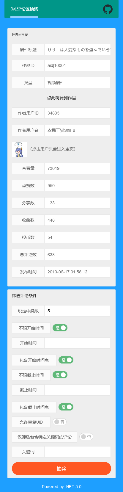

# BiliCLOnline

> Bilibili评论区第三方抽奖工具（WEB）

## 介绍

本项目是上一年写的WPF应用[BiliCommentLottery](https://github.com/InJeCTrL/BiliCommentLottery)的升级版，尽管当时使用的SDK是DotNet Core 3.1，但由于WPF是Windows操作系统的专用UI框架，无法跨平台，给许多使用者带来些许不便，所以这次重构了老项目，将其由WPF应用改为WEB应用，后端使用DotNet 5.0开发WebAPI，前端界面使用LayUI搭建，这次在诸多平台上都可以使用了！（直接访问这个repo的[github-pages](https://injectrl.github.io/BiliCLOnline/)就可以）

## 特点

- [x] PC端、移动端均可使用（B/S）
- [x] 支持视频稿件、专栏稿件、动态的AV号/BV号/CV号/动态号
- [x] 支持视频稿件、专栏稿件、动态的URL
- [x] 支持移动端复制的分享短链接
- [x] 根据开始时间、截止时间筛选评论列表
- [x] 根据评论内容筛选评论列表
- [x] 可根据UID对评论去重
- [x] 可复制评论网址方便访问
- [x] 展示目标作品、作者的各项数据

## 使用方法

主要说明在开始页面输入的“ID/URL”的规则。

1. ID

   目前支持视频稿件、专栏稿件、动态的ID
   
   - 视频稿件的ID分为**AV号**（旧版，如`av10001`）和**BV号**（新版，如`BV1bx411c7us`）
   
   - 专栏稿件的ID为CV号（如`cv7030871`）
   
   - 动态ID是跟随在动态链接之后的一串数字，如：
   
     某个动态的URL为：`https://t.bilibili.com/495388103523775735`，那么动态ID就是`495388103523775735`
   
2. URL

   目前支持视频稿件、专栏稿件、动态的网页URL和移动端分享URL

   - 视频稿件的URL类型是：
     1. `https://www.bilibili.com/video/av10001`
     2. `https://www.bilibili.com/video/BV1bx411c7us`
     
   - 专栏稿件的URL类型是：
   
     `https://www.bilibili.com/read/cv7030871`
     
   - 动态的URL类型是：
   
     `https://t.bilibili.com/495388103523775735`
     
   - 移动端分享URL的类型是：
   
     `https://b23.tv/Qzqqj9`

## 局限

负责获取评论列表的网络通讯逻辑由以前的“分散在每个客户端”变成现在的“集中在一个服务器”，并且从某个时间开始，Bilibili对评论接口的访问频率做出限制，所以一段时间内较高频率不间断地请求评论接口可能会使目前部署后端的服务器被短时间封禁。为了避免服务器老被官方封禁，我在加入了适当的延迟，这可能在使用过程中增加等待时间。

## 效果展示展示

1. PC端目标设定页面

   

2. PC端抽奖设定页面

   

3. PC端抽奖完成展示页面

   

4. 移动端抽奖设定页面

   

## 使用技术

- 后端WebAPI: DotNet 5.0
- 前端UI: LayUI 2.5.7

