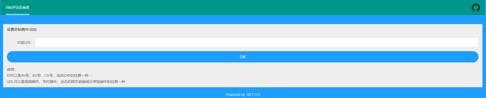
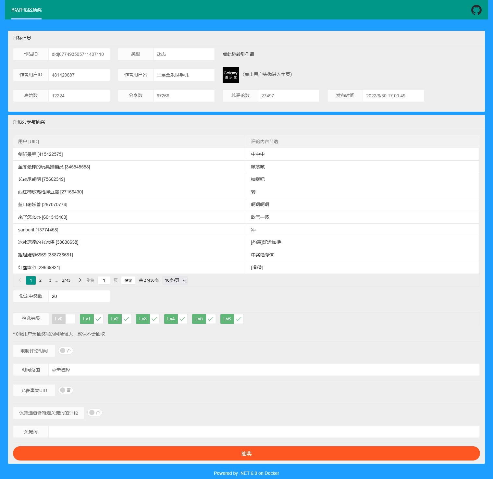
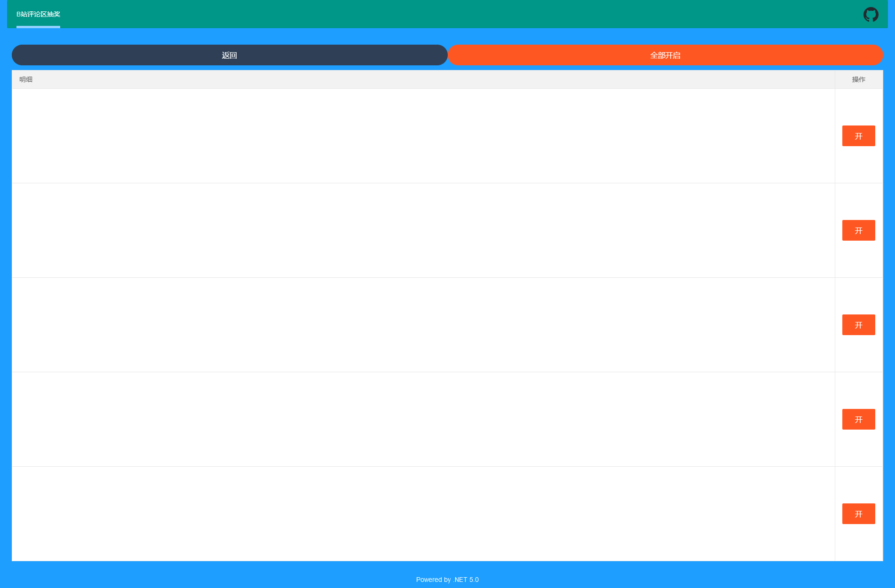

# BiliCLOnline

> Bilibili评论区第三方抽奖工具（WEB）

***感谢长期以来对BiliCLOnline项目的支持，欢迎使用更新的[BiliCLMonkey项目（B站评论区抽奖油猴脚本）](https://github.com/InJeCTrL/BiliCLMonkey)！本项目将逐渐降低维护频率，服务端暂时不会有频繁更新，[本地版本](https://github.com/InJeCTrL/BiliCLOnline/releases/tag/LocalVersion)仍可使用。***

## 介绍

本项目是上一年写的WPF应用[BiliCommentLottery](https://github.com/InJeCTrL/BiliCommentLottery)的升级版，尽管当时使用的SDK是DotNet Core 3.1，但由于WPF是Windows操作系统的专用UI框架，无法跨平台，给许多使用者带来些许不便，所以这次重构了老项目，将其由WPF应用改为WEB应用，后端基于DotNet Core开发WebAPI，前端界面使用LayUI搭建，这次在诸多平台上都可以使用了！（直接访问这个repo的[github-pages](https://injectrl.github.io/BiliCLOnline/)就可以）

由于后端服务部署在海外，请求网络质量无法保证。若频繁提示服务不可用，请运行[Release中的本地版本](https://github.com/InJeCTrL/BiliCLOnline/releases/tag/LocalVersion)。

Windows用户直接运行BiliCLOnline.exe即可。

MacOS用户在BiliCLOnline文件所在目录下启动终端，并执行命令：
```bash
./BiliCLOnline
```

## 特点

- [x] PC端、移动端均可使用（B/S）
- [x] 支持视频稿件、专栏稿件、动态的AV号/BV号/CV号/动态号
- [x] 支持视频稿件、专栏稿件、动态的URL
- [x] 支持移动端复制的分享短链接
- [x] 根据开始时间、截止时间筛选评论列表
- [x] 根据评论内容筛选评论列表
- [x] 可根据UID对评论去重
- [x] 可复制评论网址方便访问
- [x] 展示目标作品、作者的各项数据

## 使用方法

主要说明在开始页面输入的“ID/URL”的规则。

1. ID

   目前支持视频稿件、专栏稿件、动态的ID
   
   - 视频稿件的ID分为**AV号**（旧版，如`av10001`）和**BV号**（新版，如`BV1bx411c7us`）
   
   - 专栏稿件的ID为CV号（如`cv7030871`）
   
   - 动态ID是跟随在动态链接之后的一串数字，如：
   
     某个动态的URL为：`https://t.bilibili.com/495388103523775735`，那么动态ID就是`495388103523775735`
   
2. URL

   目前支持视频稿件、专栏稿件、动态的网页URL和移动端分享URL

   - 视频稿件的URL类型是：
     1. `https://www.bilibili.com/video/av10001`
     2. `https://www.bilibili.com/video/BV1bx411c7us`
     
   - 专栏稿件的URL类型是：
   
     `https://www.bilibili.com/read/cv7030871`
     
   - 动态的URL类型是：
   
     `https://t.bilibili.com/495388103523775735`
     
   - 移动端分享URL的类型是：
   
     `https://b23.tv/Qzqqj9`

## 更新与其它说明

2024-01-21更新：

1. 增加自定义填写B站Cookie框，不填写Cookie默认执行扫码登录逻辑

2024-01-20更新：

1. 抽取评论前需要B站移动端扫码登录，适应B站评论接口安全策略
2. 服务以容器形式部署到AWS EC2

2023-03-17更新：

1. 允许用户运行本地服务端，以避免网络原因导致的不可用问题

2022-12-29更新：

1. 迁移部署到OKTETO K8s
2. 单次请求获取评论列表改为一次请求后轮询是否完成获取
3. 改进批次并发请求为信号量方式

2022-12-01更新：

1. 增加IP流量控制
2. 增加IP:formalId流量控制

2022-07-28更新：

1. 增加用户等级筛选功能

2022-07-27更新：

1. 抽奖逻辑调整到前端

2022-07-21更新：

1. IPRatelimit改为hcaptcha校验

2022-07-17更新：

1. 抽奖方式重新改回全量抽奖，同时规定稿件评论数上限阈值（40000）
2. 重写大部分逻辑
3. 服务由个人云服务器切换到ACI部署
4. 停用原有的免费公用代理池，使用ScrapingAnt提供代理服务
5. 切换Dotnet版本到6.0

2021-08-07更新：

评论数多（大于500）的稿件使用非全量抽奖，评论数少（不大于500）的稿件使用全量抽奖，尽可能避免重复评论导致的抽奖概率失衡。

2021-06-20更新：

移除原有的最大评论页数阈值，改为请求B站接口最大次数阈值，增加可用性。

2021-06-19更新：

将原有的全量抽奖机制修改为非全量修改机制，抽奖的时间随设定中奖数改变，最坏情况下退化为全量抽奖。

负责获取评论列表的网络通讯逻辑由以前的“分散在每个客户端”变成现在的“集中在一个服务器”，并且从某个时间开始，Bilibili对评论接口的访问频率做出限制，所以一段时间内较高频率不间断地请求评论接口可能会使目前部署后端的服务器被短时间封禁。为了避免服务器老被官方封禁，我在网络请求上接入了国内代理池，由于代理池中可用代理数量有限且切换代理有一定的时间延迟，所以可能在使用过程中增加等待时间。

## 效果展示展示

1. PC端目标设定页面

   

2. PC端抽奖设定页面

   

3. PC端抽奖完成展示页面

   


## 使用技术

- 后端WebAPI: DotNet 7.0
- 前端UI: LayUI 2.5.7
- 验证码: HCaptcha

## 后端部署

```shell
docker pull injectrl/biliclonline:latest
docker run -d -it --name {name} -p 5000:5000 -e HCaptchaSecret="xxx" -e CorsTarget="xxx" injectrl/biliclonline:latest
```

## 目前服务器端

服务以容器形式运行在AWS EC2